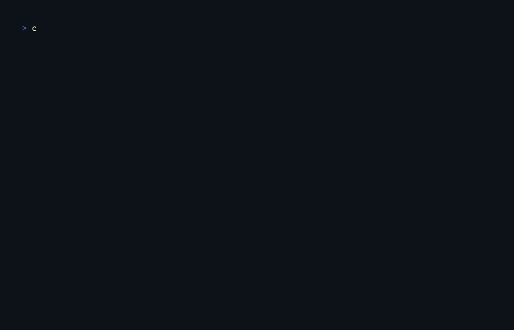

<center><h1> chess-cat </h1></center>

`chess-cat` is a simple CLI program to visualize a chess board in the terminal.



## Installation

### Manually

Clone the repository. See [build instructions](#build-instructions) for more details on how to build the program. Then run:

```bash
cargo install --path .
```

### From crates.io

> :warning: Note: `chess-cat` is not yet published on crates.io. This section will be updated once it is.

```bash
cargo install chess-cat --locked
```

## Build instructions

Make sure you have Rust installed. Then clone the repository and run:

```bash
cargo build -r
```

To run the program, use:

```bash
cargo run -r -- <FEN string>
```

To run the tests, use:

```bash
cargo test
```

## License

This project is licensed under the MIT License - see the [LICENSE](LICENSE) file for details.

## Author

| [<br><sub>@ptsouchlos</sub>](https://github.com/ptsouchlos) |
|:----:|
